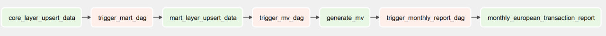
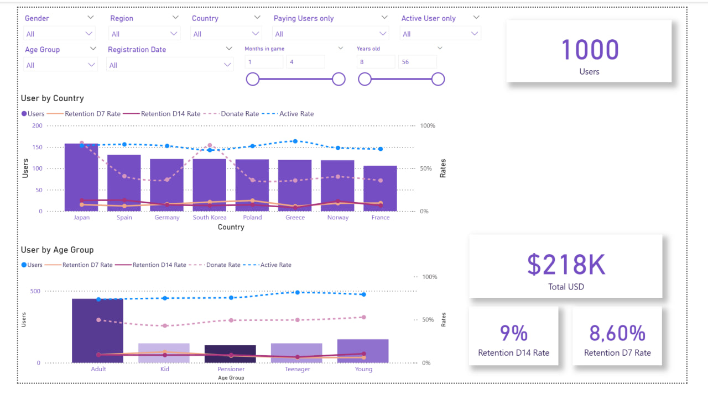
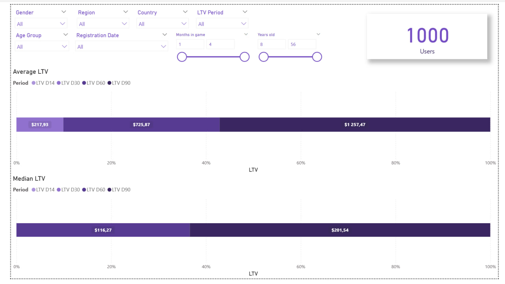
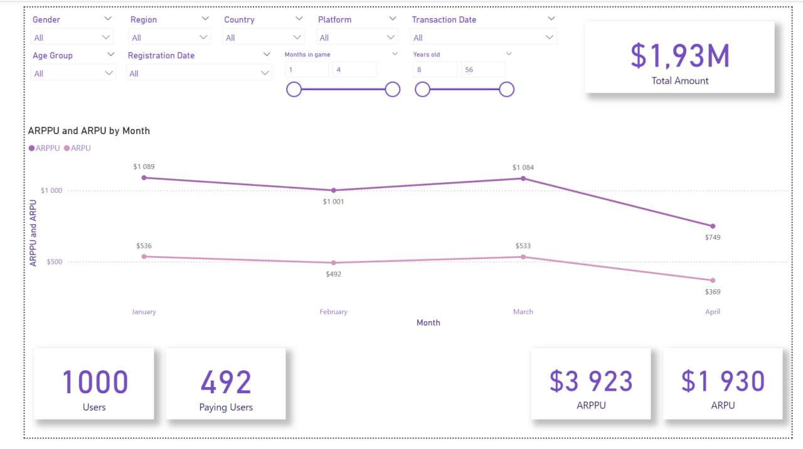
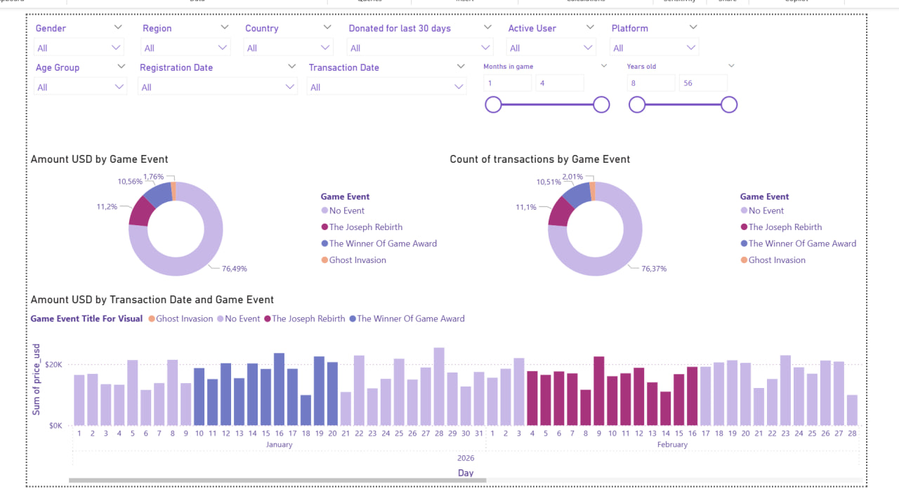
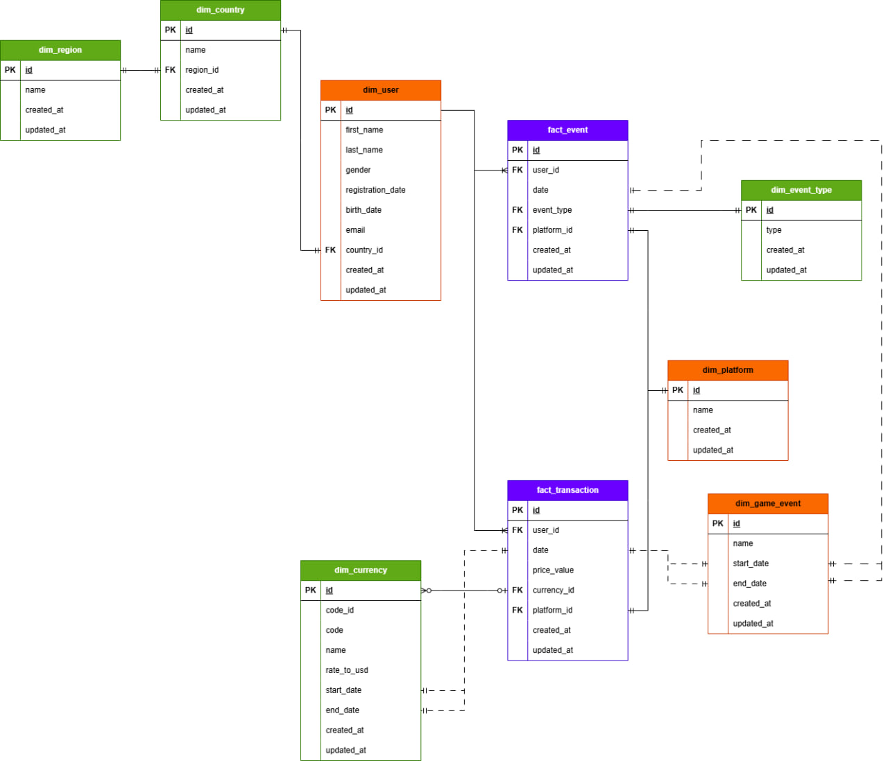

# End-to-End Data Analytics Project

## Table of contents

* ### [Introduction](#introduction-1)
* ### [Project Components](#project-components-1)
* ### [Technology Stack](#technology-stack-1)
* ### [DAG Dependencies](#dag-dependencies-1)
  * ### [Page "User"](#page-user-1)
  * ### [Page "LTV"](#page-ltv-1)
  * ### [Page "ARPU vs ARPPU"](#page-arpu-vs-arppu-1)
  * ### [Page "Transaction"](#page-transaction-1)
* ### [DWH Architecture](#dwh-architecture-1)
  * ### [Stage Layer](#stage-Layer-1)
  * ### [Core Layer](#core-Layer-1)
  * ### [Mart Layer](#mart-layer-1)
* ### [Project Structure](#project-structure-1)

## Introduction

This project demonstrates a complete end-to-end data platform designed to support data-driven business decision-making. It covers the entire analytics lifecycle, from data ingestion and transformation to visualization and statistical analysis.

The project showcases modern Data Engineering and Analytics practices by integrating data warehousing, transformation, orchestration, business intelligence, and statistical analysis into a single solution.

## Project Components

* **Data Warehouse (DWH) Development**

  * Design and implementation of a scalable data warehouse architecture.

---

* **ETL/ELT Pipelines with dbt**

  * Data transformation, modeling, testing, and documentation using dbt.

---

* **Data Orchestration with Apache Airflow**

  * Automated workflow scheduling and pipeline management.

---

* **Business Intelligence Dashboards**

  * Development of interactive dashboards and business reports in Power BI.

---

* **Statistical Analysis**

  * Exploratory data analysis, hypothesis testing, and business insights generation using Jupyter Notebooks.

---

## Technology Stack

* ### `Python`
* ### `PostgreSQL`
* ### `Docker`
* ### `Apache Airflow`
* ### `Power BI`
* ### `dbt`
* ### `Jupyter Notebook`

## DAG Dependencies

### [core_layer_upsert_data](dags/core/dag_core_layer_upsert.py)

This DAG performs an upsert of data from the **stage layer into the core layer**, applying necessary transformations and data standardization using **dbt models**.  
It ensures that raw ingested data is cleaned, validated, and structured according to the core data model.

---

### [mart_layer_upsert_data](dags/mart/dag_mart_layer_upsert.py)

This DAG performs an upsert of data from the **core layer into the mart layer**, creating denormalized tables for key business entities using **dbt models**.  
It simplifies analytics by removing the need for complex joins and provides analytics-ready datasets for BI and reporting.

---

### [generate_mv](dags/mart/dag_generate_mv.py)

This DAG creates **materialized views in the mart layer** using **dbt models**, which store precomputed business metrics such as:
- LTV (Lifetime Value)
- Retention
- other key performance indicators

These views are persisted as tables to improve query performance and support BI tools.

---

### [monthly_european_transaction_report](dags/email_sending/monthly/dag_europe_team_transactions.py)

This DAG runs on a **monthly schedule (1st day of each month)**.  
If the condition is met, it generates a CSV report containing transactions of active European users, including their **first five transactions**.

After generation, the CSV file is **sent via Telegram messenger** to the configured recipients for further distribution and analysis.

---

## Dashboard screenshots

---

### Page "User"

This dashboard provides an interactive overview of user behavior, engagement, retention, and monetization metrics. It is designed to help analysts and stakeholders explore the player base across different demographic and geographical segments.

---

### Page "LTV"

This dashboard provides an overview of user lifetime value across different time horizons, helping evaluate long-term revenue generation and customer profitability.

---

### Page "ARPU vs ARPPU"

This dashboard provides a comparative analysis of Average Revenue Per User (ARPU) and Average Revenue Per Paying User (ARPPU) over time. It helps evaluate overall monetization performance and understand the contribution of paying users to total revenue.

---

### Page "Transaction"

This dashboard provides an analytical view of transaction behavior over time, with a focus on how user spending patterns evolve in relation to in-game events and content releases.

---

## DWH Architecture

The data warehouse is organized into three logical layers: **Stage**, **Core**, and **Mart**.

---

### Stage Layer

The **Stage** layer stores raw data extracted directly from source systems. This layer serves as the initial landing zone for data ingestion and preserves the original structure of the source data. Minimal transformations are performed at this stage, ensuring data traceability and simplifying debugging processes.

---

### Core Layer

The **Core** layer contains the primary data transformation and integration logic. Here, raw data is cleaned, validated, standardized, and enriched according to business requirements.

The data model in this layer follows a **Snowflake Schema**, where dimensions are normalized and may reference other dimension tables. This approach reduces data redundancy while maintaining a consistent and scalable analytical model that serves as the single source of truth across the warehouse.

---

### Mart Layer

The **Mart** layer is the presentation layer of the warehouse. It contains denormalized tables and materialized views specifically designed for analytical workloads and reporting.

Datasets in this layer are optimized for fast querying and easy consumption, minimizing the need for complex joins. These business-ready data marts are used as the primary source for BI dashboards, reporting, and statistical analysis.

---

## Project Structure

* **[dags:](dags)** the folder contains code for data orchestration in Apache Airflow;
* **[dbt:](dbt)** the folder contains code for dbt part of project like models, config files and metadata;
* **[docs:](docs)** the folder with images for documentation in README.md files;
* **[notebook:](notebook)** the folder with Jupyter notebooks for statistical analysis;
* **[Dashboard.pbix:](Dashboard.pbix)** the Microsoft Power BI file that contains BI-report;
